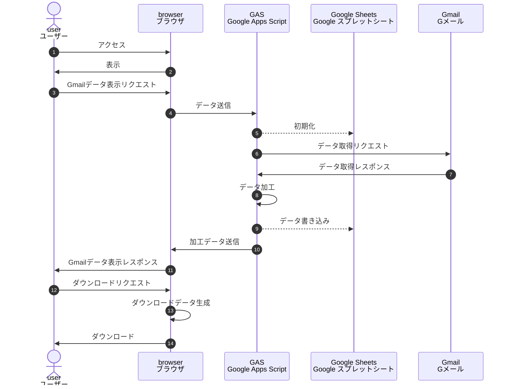

# gas-virusmail-search
ウイルスメール集計
```
.
├── README.md                # 説明
├── appsscript.json          # マニフェストファイル
├── common.gs                # 共通クラス
├── config.gs                # 設定クラス
├── css.html                 # css
├── index.html               # html
├── js.html                  # javascript
├── main.gs                  # main処理(web呼び出し・gas連携)
├── virusAggregate.gs        # メールデータ取得スクリプト(web画面連携)
└── virusAggregateScript.gs  # メールデータ取得スクリプト(単体)
```
#### シーケンス図

